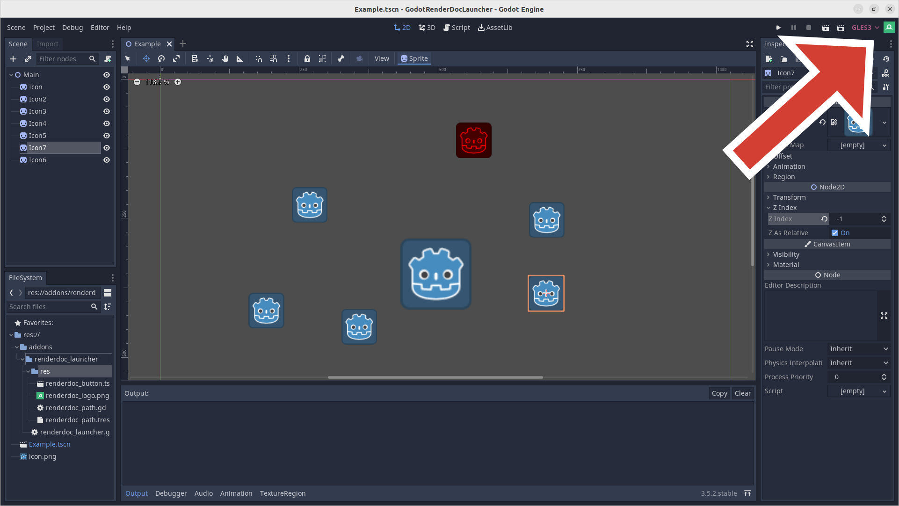
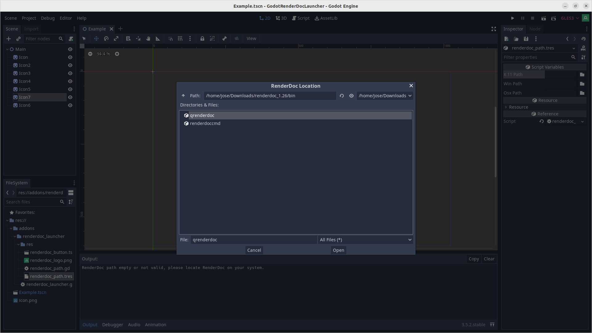
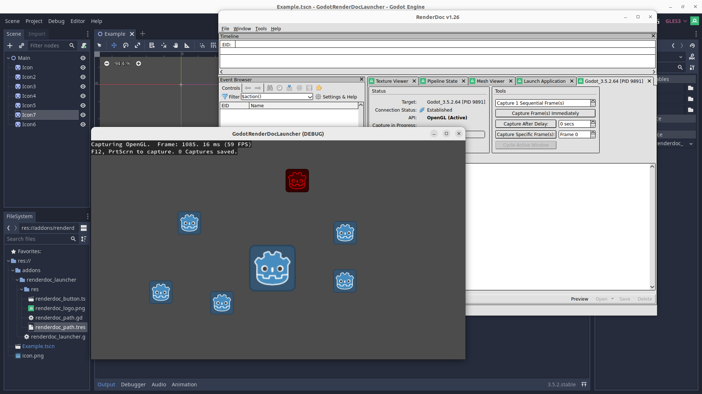

# GodotRenderDocLauncher

This plugin tool adds a button to Godot's editor allowing you to easily launch [RenderDoc](https://renderdoc.org/) so you can quickly see how your changes are affecting the game's rendering.

## Intro
When developing a game it is always important to be mindful of its performance. This can be measured in a few areas, namely rendering.

Especially when working with an engine like Godot or Unity, one might not be fully aware of the impact of actions such as adding that extra Node or GameObject, changing up the SceneTree or Hierarchy in a certain way, etc.

How do these actions translate to the engine’s renderer and ultimately, API calls?

[RenderDoc](https://renderdoc.org/) is a tool which can help us with that.

Not only can it help us identify bottlenecks in our scene, it can also serve as debugger to check the state of pipeline when looking for what went wrong drawing that piece of custom geometry.

## Motivation

I created this plugin to simplify my workflow when using RenderDoc.

Previously, I had to export my game and adjust RenderDoc's settings each time I made a change, which was tedious. I later discovered that I could directly launch a Godot project with the command-line argument "--path <path_to_your_project>" instead of having to export the game's executable, which made things easier. 

However, I still wanted quicker access to RenderDoc without having to navigate through multiple menus or search for file paths.

## Walkthrough

The first time you click the button you will be prompted to provide RenderDoc's location. This will be saved in a resource file.

After you provide RenderDoc's location, it will be launched and the game will automatically start. This and other launch settings can be found at addons/renderdoc_launcher/res/settings.cap.

**Notes:**  If you work/test your game on multiple OS's it should work fine as the plugin stores a location for each OS.
If you find yourself working with other people, it might be a good idea to add `addons/renderdoc_launcher/res/renderdoc_path.tres` to your .gitignore so you dont overwrite each others RenderDoc locations.

---

Hope this small tool can make your life easier when optimizing and iterating :)
