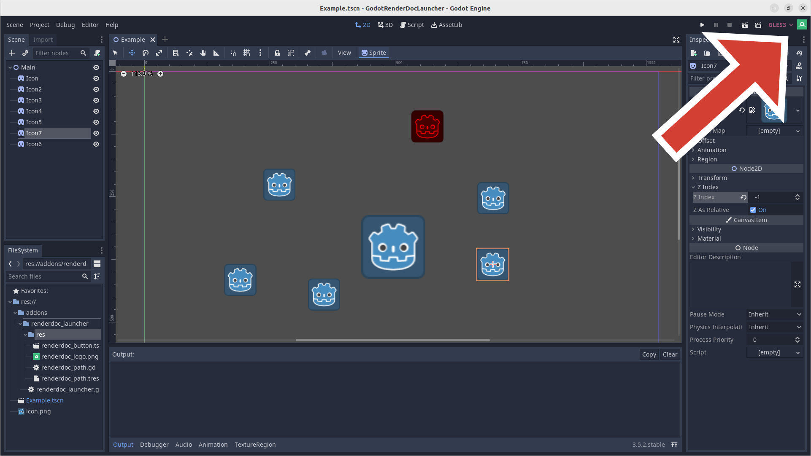
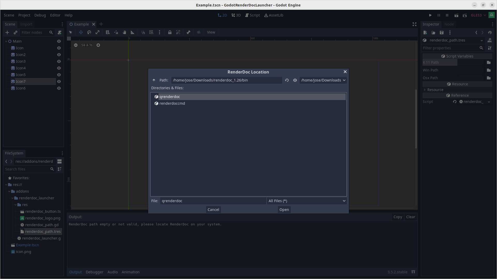
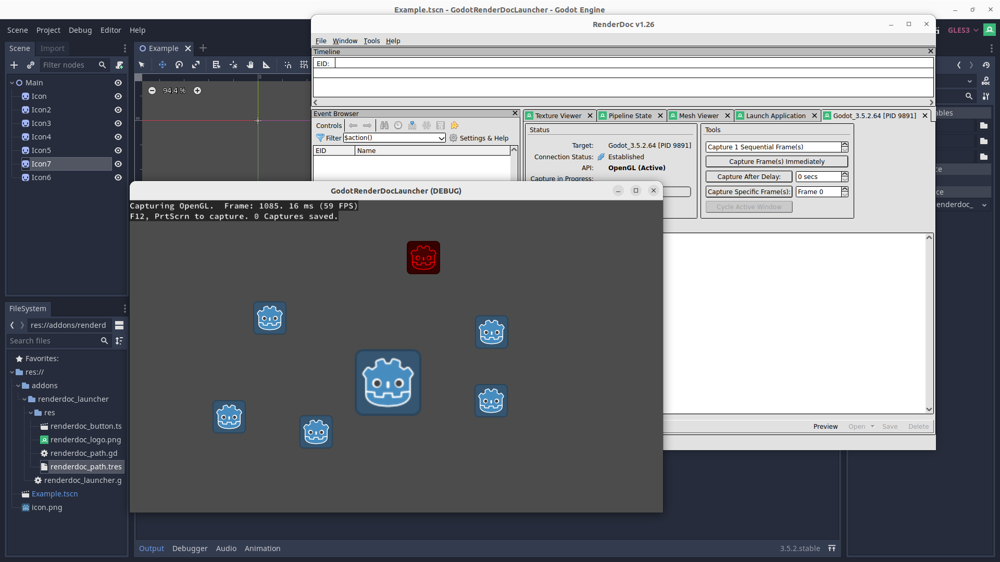

# GodotRenderDocLauncher

This plugin tool adds a button to Godot's editor allowing you to easily launch RenderDoc so you can quickly see how your changes are affecting the game's rendering.

## Motivation

I created this plugin to simplify my workflow when using RenderDoc.

Previously, I had to export my game and adjust RenderDoc's settings each time I made a change, which was tedious. I later discovered that I could directly launch Godot with the command-line argument "--path <path_to_your_project>" instead of launching the game's executable, which made things easier. 

However, I still wanted quicker access to RenderDoc without having to navigate through multiple menus or search for file paths.

## Walkthrough

The first time you click the button you will be prompted to provide RenderDoc's location. This will be save in a resource file.

After you provide RenderDoc's location, it will be launched and the game will automatically start. This and other launch settings can be found at addons/renderdoc_launcher/res/settings.cap.

---

Hope this small tool can make your life easier when optimzing and iterating :)
